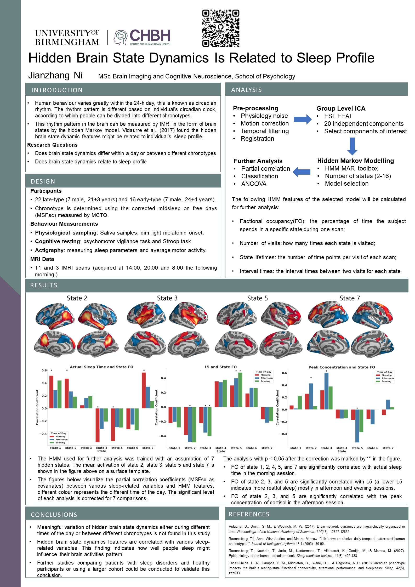

# Master-Data-Analysis

## Poster

## Abstract
**Introduction:** Human behaviour varies greatly within the 24-h day. 
This circadian rhythm is different based on individual’s circadian clock, according to which people can be divided into different chronotypes. 
The rhythm pattern in the brain can be measured by fMRI in the form of brain states by the hidden Markov model (HMM). 
Studying chronotype not only has its social-economical effect but also may affect recruitment regimes for any neuroimaging study probing cognition. 
We suggest that brain state dynamics may differ within a day or between different chronotypes and may correlate with individual’s sleep profile. 

**Method:** This study included 22 late-type (7 male, 21±3 years) and 16 early-type (7 male, 24±4 years) participants. 
We collected saliva samples, actigraphy and cognitive testing data from all participants. 
3 fMRI scans (at different times of day) were acquired. 
Group level ICA was performed with 20 independent components for HMM inference. 
HMM with the state number of 7 is used for further analysis after model selection.

**Results:** Fractional occupancy of different states is significantly correlated with various actual sleep-related variables such as actual sleep time, 
peak concentration of cortisol, and actigraphy features. 
No group difference is found between different times of day or chronotypes. 

**Discussion:** Hidden brain state dynamics features are correlated with various sleep-related variables. 
This finding indicates how well people sleep might influence their brain activities pattern. 
Further studies comparing patients with sleep disorders and healthy participants 
or using a larger cohort could be conducted to validate this conclusion. 

# Structure of the Repo
This repo mostly contains the code used for HMM modeling and further analysis and a few figures.

**Folder Tree**
## HMM Modeling
The code for HMM modeling is in `hmm_jobfile` folder.
The code for HMM feature extraction is in `scripts/matlab/` folder.

## Further Analysis
The Python code used for model selection and further analysis is in `scripts`folder
### Warped Python Functions
global_variables.py

collection.py

stat.py 

ml.py

figures.py

### Main Notebooks
model selection:

meta state:

classification:

correlation:

group analysis:

PySurfer:

